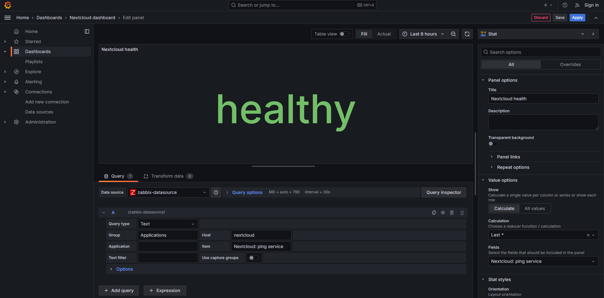
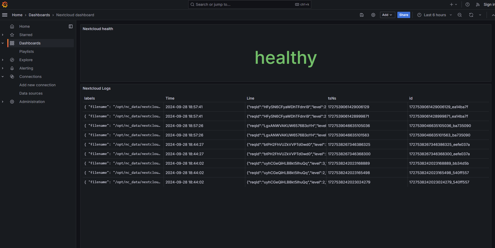

## Ход работы

### Запуск docker compose

### Инициализация nextcloud

### Promtail подключился к нужному файлу

### Импорт шаблона в zabbix

### Разрешение использовать имя nextcloud

### Добавление хоста в zabbix

### Добавление источников данных в Grafana

### Дэшборды

## Вопросы

### Чем SLO отличается от SLA?

SLO (Service Level Objective) — это конкретная цель в рамках метрик доступности и производительности. SLA (Service Level Agreement) — это договорное обязательство перед клиентом, включающее последствия за несоблюдение SLO.

### Чем отличается инкрементальный бэкап от дифференциального?

Инкрементальный бэкап сохраняет только изменения с момента последнего бэкапа (полного или инкрементального). Дифференциальный бэкап сохраняет изменения с момента последнего полного бэкапа.

### В чем разница между мониторингом и observability?

Мониторинг — это отслеживание заранее известных метрик. Observability (наблюдаемость) — это возможность понять поведение системы на основе данных (логов, метрик, трассировок), даже если проблема ранее не была предсказана.
