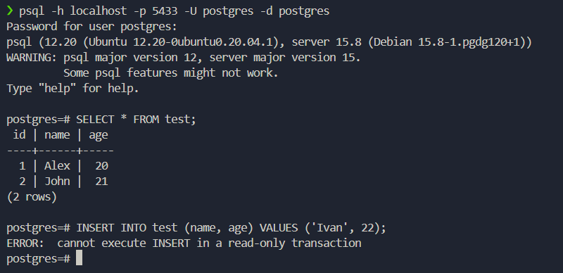

# Лабораторная работа №3

## 1. Деплой docker compose

Запустил docker compose, контейнер с названием `pg-slave` оказался на самом деле мастером.

## 2. Проверка репликации

### Заполнение базы данных на мастере

Таблица успешно создалась, данные удалось записать.

### Заполнение базы данных на слейве

Данные с мастера синхронизировались, данные записать нельзя.

## 3. Настройка HAProxy

HAProxy поднялся и перенаправляет трафик на мастер.

## 4. Задание

> Любым способом выключаем доступ до ноды, которая сейчас является мастером (например, через docker stop). Некоторое время ждем, после этого анализируем логи и так же пытаемся считать/записать что-то в БД через entrypoint подключение.

Отключил контейнер с мастером, patroni и haproxy успешно отработали и переключили трафик на слейва.

## Вопросы

1. Порты 8008 и 5432 вынесены в разные директивы, expose и ports. По сути, если записать 8008 в ports, то он тоже станет exposed. В чем разница?

    - **expose** указывает, какие порты контейнер делает доступными для других контейнеров в одной сети Docker. Эти порты видимы только внутри сети Docker и не доступны извне (т.е., снаружи хоста, на котором запущен контейнер).

    - **ports** пробрасывает порты из контейнера на хост-машину, позволяет обращаться к этим портам извне через IP-адрес хоста.

2. При обычном перезапуске композ-проекта, будет ли сбилден заново образ? А если предварительно отредактировать файлы postgresX.yml? А если содержимое самого Dockerfile? Почему?

    - При обычном перезапуске композ-проекта образы не будут пересобираться.

    - Если предварительно отредактировать файлы postgresX.yml: эти файлы передаются в контейнер как внешние данные (COPY в Dockerfile), поэтому изменение этих файлов не приводит к пересборке образа.

    - Изменение содержания Dockerfile также не приведет к пересборке образа.

    - Чтобы пересобрать образы, нужно запустить композ с флагом `--build`
